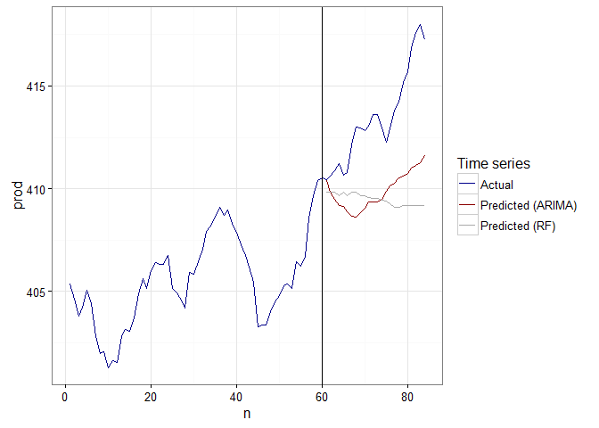
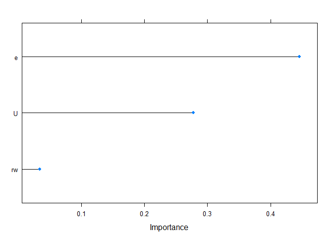

<!-- README.md is generated from README.Rmd. Please edit that file -->
caret.ts: time series models for the "caret" package
====================================================

[](https://travis-ci.org/sfeuerriegel/caret.ts) [](https://cran.r-project.org/package=caret.ts) [](https://codecov.io/github/sfeuerriegel/caret.ts?branch=master)

**caret.ts** provides various functions for machine learning with time series data. While the "caret" package is common in various tasks related to machine learning; its naive version does yet ship dedicated time series models. This implementation thus extends the "caret" package and offers additional models, including ARMA or ARIMA. Additionally, it customizes the "train" function to accept time series data.

Overview
--------

The most important functions in **caret.ts** are:

-   TODO.

To see examples of these functions in use, check out the help pages, the demos and the vignette.

Installation
------------

Using the **devtools** package, you can easily install the latest development version of **caret.ts** with

``` r
install.packages("devtools")

# Option 1: download and install latest version from ‘GitHub’
devtools::install_github("sfeuerriegel/caret.ts")

# Option 2: install directly from bundled archive
# devtoos::install_local("caret.ts_0.1.0.tar.gz")
```

Notes:

-   In the case of option 2, you have to specify the path either to the directory of **caret.ts** or to the bundled archive **caret.ts\_0.1.0.tar.gz**

-   A CRAN version has not yet been released.

Usage of models
---------------

This section shows the basic functionality of how to perform machine learning with time seris models inside **caret**. First, load the corresponding package **caret.ts**.

``` r
library(caret.ts)
#> Warning: package 'caret' was built under R version 3.3.1
```

The examples below how to insert the models inside the `train()` function from **caret**. Additionally, this package also implements an additional variant of the `train()` function that accepts time series objects (see below).

### ARMA model

Auto-regressive moving-average (ARMA) models can be faciliated both with and without exogeneous variables. By using `arma_model(p, q)`, one can construct an ARMA model of a fixed, pre-defined order. Alternatively, one can let the `train()` function pick the order that fits the training data best. For the latter purpose, use `auto_arma_model()` (with optional arguments for the maximum order).

**Example without exogenous variables:**

``` r
library(forecast)
data(WWWusage) # from package "forecast"
df <- data.frame(y = as.numeric(WWWusage))

arma <- train(y ~ 1, data = df, method = arma_model(1, 1), trControl = trainDirectFit())
summary(arma)
#> Series: y 
#> ARIMA(1,0,1) with non-zero mean 
#> 
#> Coefficients:
#>          ar1     ma1  intercept
#>       0.9927  0.7984   149.3662
#> s.e.  0.0089  0.0459    48.4678
#> 
#> sigma^2 estimated as 14.78:  log likelihood=-278.24
#> AIC=564.49   AICc=564.91   BIC=574.91
#> 
#> Training set error measures:
#>                     ME     RMSE      MAE       MPE     MAPE      MASE
#> Training set 0.6382458 3.786451 3.002197 0.3772227 2.336051 0.6634319
#>                   ACF1
#> Training set 0.4253221

predict(arma, df)
#>   [1] 218.6332 218.1282 217.6269 217.1292 216.6352 216.1448 215.6579
#>   [8] 215.1746 214.6948 214.2186 213.7458 213.2764 212.8105 212.3479
#>  [15] 211.8888 211.4329 210.9804 210.5312 210.0853 209.6426 209.2032
#>  [22] 208.7670 208.3339 207.9040 207.4772 207.0536 206.6330 206.2155
#>  [29] 205.8010 205.3896 204.9812 204.5757 204.1732 203.7736 203.3770
#>  [36] 202.9832 202.5923 202.2043 201.8190 201.4366 201.0570 200.6802
#>  [43] 200.3061 199.9347 199.5660 199.2000 198.8367 198.4760 198.1180
#>  [50] 197.7626 197.4098 197.0595 196.7118 196.3666 196.0240 195.6838
#>  [57] 195.3461 195.0109 194.6781 194.3478 194.0198 193.6943 193.3711
#>  [64] 193.0503 192.7318 192.4157 192.1018 191.7902 191.4810 191.1739
#>  [71] 190.8691 190.5665 190.2662 189.9680 189.6720 189.3781 189.0864
#>  [78] 188.7968 188.5094 188.2240 187.9407 187.6595 187.3803 187.1032
#>  [85] 186.8280 186.5549 186.2838 186.0147 185.7475 185.4822 185.2189
#>  [92] 184.9575 184.6981 184.4405 184.1848 183.9309 183.6789 183.4288
#>  [99] 183.1804 182.9339
RMSE(predict(arma, df), df)
#> [1] 76.47249
```

**Example with exogenous variables:**

``` r
library(vars)
data(Canada)
 
arma <- train(x = Canada[, -2], y = Canada[, 2], 
              method = arma_model(2, 0), trControl = trainDirectFit())
 
summary(arma)
#> Series: y 
#> ARIMA(2,0,0) with non-zero mean 
#> 
#> Coefficients:
#>          ar1      ar2  intercept       e       rw       U
#>       1.2225  -0.2815    79.2940  0.3500  -0.0065  0.1671
#> s.e.  0.1224   0.1197   160.3588  0.1935   0.0668  0.3154
#> 
#> sigma^2 estimated as 0.4929:  log likelihood=-87.65
#> AIC=189.3   AICc=190.78   BIC=206.32
#> 
#> Training set error measures:
#>                       ME      RMSE       MAE          MPE      MAPE
#> Training set -0.02779965 0.6765253 0.5457459 -0.007232222 0.1339622
#>                   MASE        ACF1
#> Training set 0.9330177 -0.02118302
arimaorder(arma$finalModel) # order of best model
#> [1] 2 0 0
 
predict(arma, Canada[, -2]) # in-sample predictions
#>  [1] 406.1969 405.9850 405.8822 406.0181 406.2726 406.3626 406.2504
#>  [8] 406.0809 405.6873 405.3071 404.9517 404.7529 404.7910 405.0912
#> [15] 405.4219 405.4222 405.4119 405.5803 405.8142 405.8943 405.9596
#> [22] 406.2119 406.4319 406.6937 406.9195 407.0858 407.1430 407.2466
#> [29] 407.4172 407.7343 407.9627 408.2730 408.4922 408.6072 408.6995
#> [36] 408.9247 409.2462 409.2362 409.3105 409.4712 409.6519 409.6905
#> [43] 409.6678 409.4946 409.2716 409.3213 409.3386 409.2447 409.1061
#> [50] 409.1051 409.1448 409.2314 409.2883 409.3843 409.4918 409.5542
#> [57] 409.5593 409.7962 410.0534 410.2487 410.4162 410.3492 410.4023
#> [64] 410.4651 410.6028 410.6676 410.7294 410.7802 411.0274 411.2709
#> [71] 411.5513 411.7147 411.8190 412.0223 412.2784 412.5129 412.6940
#> [78] 412.9221 413.0893 413.2584 413.5332 413.6623 413.7822 414.0322
RMSE(predict(arma, Canada[, -2]), Canada[, 2]) # in-sample RMSE
#> [1] 2.520015
```

Predictions and testing:

### ARIMA model

Auto-regressive moving-average models with differneces (ARIMA) also support exogeneous variables if desired. By using `arima_model(p, d, q)`, one can construct an ARIMA model of a fixed, pre-defined order:

-   `p`: Order of auto-regressive (AR) terms

-   `d`: Degree of differencing

-   `q`: Order of moving-average (MA) terms

Alternatively, one can let the `train()` function pick the order that fits the training data best. For the latter purpose, use `auto_arima_model()` (with optional arguments for the maximum order).

**Example without exogenous variables:**

``` r
library(forecast)

data(WWWusage) # from package "forecast"
df <- data.frame(y = as.numeric(WWWusage))

library(caret)

# ARIMA model of order (1, 1, 1)

arima1 <- train(y ~ 1, data = df, method = arima_model(1, 1, 1), trControl = trainDirectFit())

summary(arima1)
#> Series: y 
#> ARIMA(1,1,1)                    
#> 
#> Coefficients:
#>          ar1     ma1
#>       0.6504  0.5256
#> s.e.  0.0842  0.0896
#> 
#> sigma^2 estimated as 9.995:  log likelihood=-254.15
#> AIC=514.3   AICc=514.55   BIC=522.08
#> 
#> Training set error measures:
#>                     ME     RMSE      MAE       MPE     MAPE      MASE
#> Training set 0.3035616 3.113754 2.405275 0.2805566 1.917463 0.5315228
#>                     ACF1
#> Training set -0.01715517

predict(arima1, df) # in-sample predictions
#>   [1] 218.8805 218.1524 217.6789 217.3709 217.1706 217.0403 216.9556
#>   [8] 216.9005 216.8646 216.8413 216.8262 216.8163 216.8099 216.8057
#>  [15] 216.8030 216.8013 216.8001 216.7994 216.7989 216.7986 216.7984
#>  [22] 216.7982 216.7981 216.7981 216.7980 216.7980 216.7980 216.7980
#>  [29] 216.7980 216.7980 216.7980 216.7980 216.7980 216.7980 216.7980
#>  [36] 216.7980 216.7980 216.7980 216.7980 216.7980 216.7980 216.7980
#>  [43] 216.7980 216.7980 216.7980 216.7980 216.7980 216.7980 216.7980
#>  [50] 216.7980 216.7980 216.7980 216.7980 216.7980 216.7980 216.7980
#>  [57] 216.7980 216.7980 216.7980 216.7980 216.7980 216.7980 216.7980
#>  [64] 216.7980 216.7980 216.7980 216.7980 216.7980 216.7980 216.7980
#>  [71] 216.7980 216.7980 216.7980 216.7980 216.7980 216.7980 216.7980
#>  [78] 216.7980 216.7980 216.7980 216.7980 216.7980 216.7980 216.7980
#>  [85] 216.7980 216.7980 216.7980 216.7980 216.7980 216.7980 216.7980
#>  [92] 216.7980 216.7980 216.7980 216.7980 216.7980 216.7980 216.7980
#>  [99] 216.7980 216.7980
RMSE(predict(arima1, df), df) # in-sample RMSE
#> [1] 89.18835

# ARIMA model of order (1, 2, 1)

arima2 <- train(y ~ 1, data = df, method = arima_model(1, 2, 1), trControl = trainDirectFit())

summary(arima2)
#> Series: y 
#> ARIMA(1,2,1)                    
#> 
#> Coefficients:
#>           ar1     ma1
#>       -0.2662  0.6140
#> s.e.   0.1820  0.1369
#> 
#> sigma^2 estimated as 11.73:  log likelihood=-258.8
#> AIC=523.59   AICc=523.85   BIC=531.35
#> 
#> Training set error measures:
#>                      ME     RMSE      MAE       MPE     MAPE      MASE
#> Training set 0.01532745 3.356088 2.640365 0.1542981 2.078754 0.5834736
#>                     ACF1
#> Training set -0.05217069

predict(arima2, df) # in-sample predictions
#>   [1] 218.18979 216.32907 214.48179 212.63093 210.78103 208.93087 207.08078
#>   [8] 205.23067 203.38056 201.53046 199.68035 197.83025 195.98014 194.13004
#>  [15] 192.27993 190.42983 188.57972 186.72962 184.87951 183.02940 181.17930
#>  [22] 179.32919 177.47909 175.62898 173.77888 171.92877 170.07867 168.22856
#>  [29] 166.37846 164.52835 162.67825 160.82814 158.97804 157.12793 155.27783
#>  [36] 153.42772 151.57762 149.72751 147.87740 146.02730 144.17719 142.32709
#>  [43] 140.47698 138.62688 136.77677 134.92667 133.07656 131.22646 129.37635
#>  [50] 127.52625 125.67614 123.82604 121.97593 120.12583 118.27572 116.42561
#>  [57] 114.57551 112.72540 110.87530 109.02519 107.17509 105.32498 103.47488
#>  [64] 101.62477  99.77467  97.92456  96.07446  94.22435  92.37425  90.52414
#>  [71]  88.67404  86.82393  84.97382  83.12372  81.27361  79.42351  77.57340
#>  [78]  75.72330  73.87319  72.02309  70.17298  68.32288  66.47277  64.62267
#>  [85]  62.77256  60.92246  59.07235  57.22225  55.37214  53.52204  51.67193
#>  [92]  49.82182  47.97172  46.12161  44.27151  42.42140  40.57130  38.72119
#>  [99]  36.87109  35.02098
RMSE(predict(arima2, df), df) # in-sample RMSE
#> [1] 80.33532

# Auto-tuned ARIMA model

auto_arima <- train(y ~ 1, data = df, method = auto_arima_model(), trControl = trainDirectFit())

summary(auto_arima)
#> Series: y 
#> ARIMA(1,1,1)                    
#> 
#> Coefficients:
#>          ar1     ma1
#>       0.6504  0.5256
#> s.e.  0.0842  0.0896
#> 
#> sigma^2 estimated as 9.995:  log likelihood=-254.15
#> AIC=514.3   AICc=514.55   BIC=522.08
#> 
#> Training set error measures:
#>                     ME     RMSE      MAE       MPE     MAPE      MASE
#> Training set 0.3035616 3.113754 2.405275 0.2805566 1.917463 0.5315228
#>                     ACF1
#> Training set -0.01715517
arimaorder(auto_arima$finalModel) # order of best model
#> [1] 1 1 1

predict(auto_arima, df) # in-sample predictions
#>   [1] 218.8805 218.1524 217.6789 217.3709 217.1706 217.0403 216.9556
#>   [8] 216.9005 216.8646 216.8413 216.8262 216.8163 216.8099 216.8057
#>  [15] 216.8030 216.8013 216.8001 216.7994 216.7989 216.7986 216.7984
#>  [22] 216.7982 216.7981 216.7981 216.7980 216.7980 216.7980 216.7980
#>  [29] 216.7980 216.7980 216.7980 216.7980 216.7980 216.7980 216.7980
#>  [36] 216.7980 216.7980 216.7980 216.7980 216.7980 216.7980 216.7980
#>  [43] 216.7980 216.7980 216.7980 216.7980 216.7980 216.7980 216.7980
#>  [50] 216.7980 216.7980 216.7980 216.7980 216.7980 216.7980 216.7980
#>  [57] 216.7980 216.7980 216.7980 216.7980 216.7980 216.7980 216.7980
#>  [64] 216.7980 216.7980 216.7980 216.7980 216.7980 216.7980 216.7980
#>  [71] 216.7980 216.7980 216.7980 216.7980 216.7980 216.7980 216.7980
#>  [78] 216.7980 216.7980 216.7980 216.7980 216.7980 216.7980 216.7980
#>  [85] 216.7980 216.7980 216.7980 216.7980 216.7980 216.7980 216.7980
#>  [92] 216.7980 216.7980 216.7980 216.7980 216.7980 216.7980 216.7980
#>  [99] 216.7980 216.7980
RMSE(predict(auto_arima, df), df) # in-sample RMSE
#> [1] 89.18835
```

**Example with exogenous variables:**

``` r
library(vars)
data(Canada)

arima <- train(x = Canada[, -2], y = Canada[, 2], 
               method = auto_arima_model(), trControl = trainDirectFit())

summary(arima)
#> Series: y 
#> ARIMA(2,0,0) with zero mean     
#> 
#> Coefficients:
#>          ar1      ar2       e       rw       U
#>       1.2102  -0.2763  0.4457  -0.0342  0.2776
#> s.e.  0.1171   0.1165  0.0169   0.0368  0.2215
#> 
#> sigma^2 estimated as 0.4888:  log likelihood=-87.78
#> AIC=187.55   AICc=188.64   BIC=202.14
#> 
#> Training set error measures:
#>                       ME      RMSE       MAE          MPE      MAPE
#> Training set -0.02979641 0.6780177 0.5476467 -0.007691884 0.1344207
#>                   MASE       ACF1
#> Training set 0.9362673 -0.0183326
arimaorder(arima$finalModel) # order of best model
#> [1] 2 0 0

predict(arima, Canada[, -2]) # in-sample predictions
#>  [1] 405.4994 405.2832 405.1572 405.3035 405.6309 405.7105 405.6267
#>  [8] 405.3987 404.8970 404.5051 404.1713 403.9424 404.0222 404.4012
#> [15] 404.8099 404.7607 404.7411 404.9772 405.2785 405.3657 405.4211
#> [22] 405.7300 406.0010 406.2976 406.5486 406.7743 406.8578 406.9458
#> [29] 407.1422 407.5242 407.8000 408.1256 408.3616 408.4886 408.6087
#> [36] 408.8549 409.2059 409.1863 409.2402 409.4167 409.6208 409.6419
#> [43] 409.6497 409.4363 409.1360 409.1769 409.1870 409.0469 408.8650
#> [50] 408.8673 408.9322 409.0498 409.0528 409.2108 409.3261 409.4018
#> [57] 409.3560 409.6302 409.9219 410.1296 410.3348 410.2382 410.2827
#> [64] 410.3412 410.5295 410.5687 410.6198 410.6881 410.9932 411.3019
#> [71] 411.6466 411.8066 411.9024 412.1303 412.4689 412.7548 412.9641
#> [78] 413.2387 413.4124 413.5871 413.8916 414.0445 414.1947 414.5188
RMSE(predict(arima, Canada[, -2]), Canada[, 2]) # in-sample RMSE
#> [1] 2.297104
```

### ETS

`ets_model()` integrates a so-called exponential smoothing state space (ETS) model.

``` r
data_train <- WWWusage[1:80]
data_test <- WWWusage[81:100]
 
lm <- train(data_train, method = "lm", trControl = trainDirectFit())
summary(lm)
#> 
#> Call:
#> lm(formula = .outcome ~ ., data = dat)
#> 
#> Residuals:
#>    Min     1Q Median     3Q    Max 
#> -41.80 -33.80   6.20  23.45  50.20 
#> 
#> Coefficients:
#>             Estimate Std. Error t value Pr(>|t|)    
#> (Intercept)  124.800      3.491   35.75   <2e-16 ***
#> ---
#> Signif. codes:  0 '***' 0.001 '**' 0.01 '*' 0.05 '.' 0.1 ' ' 1
#> 
#> Residual standard error: 31.23 on 79 degrees of freedom
RMSE(predict(lm, data_test), data_test)
#> [1] 69.44221
 
ets <- train(data_train, method = ets_model(), trControl = trainDirectFit())
summary(ets)
#> ETS(A,Ad,N) 
#> 
#> Call:
#>  forecast::ets(y = y, model = param$model) 
#> 
#>   Smoothing parameters:
#>     alpha = 0.997 
#>     beta  = 0.9953 
#>     phi   = 0.8306 
#> 
#>   Initial states:
#>     l = 86.8768 
#>     b = -2.285 
#> 
#>   sigma:  3.4236
#> 
#>      AIC     AICc      BIC 
#> 557.4736 558.2844 569.3837 
#> 
#> Training set error measures:
#>                     ME     RMSE      MAE       MPE     MAPE      MASE
#> Training set 0.1668264 3.423614 2.747002 0.2594915 2.335131 0.6739539
#>                   ACF1
#> Training set 0.1734724
RMSE(predict(ets, data_test), data_test)
#> [1] 48.39074
```

Evaluation
----------

### Alternative interface for training with time series objects

`trainDirectFit()`

This package automatically extends the `train()` function to successfully work with time series objects of class `ts`.

**Example with uni-variate time series:**

``` r
class(WWWusage)
#> [1] "ts"
str(WWWusage)
#>  Time-Series [1:100] from 1 to 100: 88 84 85 85 84 85 83 85 88 89 ...

# Example with uni-variate time series and no predictors

arima <- train(WWWusage, method = auto_arima_model(), trControl = trainDirectFit())

summary(arima)
#> Series: y 
#> ARIMA(1,1,1)                    
#> 
#> Coefficients:
#>          ar1     ma1
#>       0.6504  0.5256
#> s.e.  0.0842  0.0896
#> 
#> sigma^2 estimated as 9.995:  log likelihood=-254.15
#> AIC=514.3   AICc=514.55   BIC=522.08
#> 
#> Training set error measures:
#>                     ME     RMSE      MAE       MPE     MAPE      MASE
#> Training set 0.3035616 3.113754 2.405275 0.2805566 1.917463 0.5315228
#>                     ACF1
#> Training set -0.01715517
arimaorder(arima$finalModel) # order of best model
#> [1] 1 1 1

predict(arima, WWWusage) # in-sample RMSE
#>   [1] 218.8805 218.1524 217.6789 217.3709 217.1706 217.0403 216.9556
#>   [8] 216.9005 216.8646 216.8413 216.8262 216.8163 216.8099 216.8057
#>  [15] 216.8030 216.8013 216.8001 216.7994 216.7989 216.7986 216.7984
#>  [22] 216.7982 216.7981 216.7981 216.7980 216.7980 216.7980 216.7980
#>  [29] 216.7980 216.7980 216.7980 216.7980 216.7980 216.7980 216.7980
#>  [36] 216.7980 216.7980 216.7980 216.7980 216.7980 216.7980 216.7980
#>  [43] 216.7980 216.7980 216.7980 216.7980 216.7980 216.7980 216.7980
#>  [50] 216.7980 216.7980 216.7980 216.7980 216.7980 216.7980 216.7980
#>  [57] 216.7980 216.7980 216.7980 216.7980 216.7980 216.7980 216.7980
#>  [64] 216.7980 216.7980 216.7980 216.7980 216.7980 216.7980 216.7980
#>  [71] 216.7980 216.7980 216.7980 216.7980 216.7980 216.7980 216.7980
#>  [78] 216.7980 216.7980 216.7980 216.7980 216.7980 216.7980 216.7980
#>  [85] 216.7980 216.7980 216.7980 216.7980 216.7980 216.7980 216.7980
#>  [92] 216.7980 216.7980 216.7980 216.7980 216.7980 216.7980 216.7980
#>  [99] 216.7980 216.7980
RMSE(predict(arima, WWWusage), WWWusage) # in-sample RMSE
#> [1] 89.18835
```

**Example for time series with exogenous predictors:**

``` r
class(Canada)
#> [1] "mts" "ts"
str(Canada)
#>  Time-Series [1:84, 1:4] from 1980 to 2001: 930 930 930 931 933 ...
#>  - attr(*, "dimnames")=List of 2
#>   ..$ : NULL
#>   ..$ : chr [1:4] "e" "prod" "rw" "U"

# Variant with explicit x and y

arima <- train(x = Canada[, -2], y = Canada[, 2], 
               method = auto_arima_model(), trControl = trainDirectFit())

summary(arima)
#> Series: y 
#> ARIMA(2,0,0) with zero mean     
#> 
#> Coefficients:
#>          ar1      ar2       e       rw       U
#>       1.2102  -0.2763  0.4457  -0.0342  0.2776
#> s.e.  0.1171   0.1165  0.0169   0.0368  0.2215
#> 
#> sigma^2 estimated as 0.4888:  log likelihood=-87.78
#> AIC=187.55   AICc=188.64   BIC=202.14
#> 
#> Training set error measures:
#>                       ME      RMSE       MAE          MPE      MAPE
#> Training set -0.02979641 0.6780177 0.5476467 -0.007691884 0.1344207
#>                   MASE       ACF1
#> Training set 0.9362673 -0.0183326
arimaorder(arima$finalModel) # order of best model
#> [1] 2 0 0

predict(arima, Canada[, -2]) # in-sample predictions
#>  [1] 405.4994 405.2832 405.1572 405.3035 405.6309 405.7105 405.6267
#>  [8] 405.3987 404.8970 404.5051 404.1713 403.9424 404.0222 404.4012
#> [15] 404.8099 404.7607 404.7411 404.9772 405.2785 405.3657 405.4211
#> [22] 405.7300 406.0010 406.2976 406.5486 406.7743 406.8578 406.9458
#> [29] 407.1422 407.5242 407.8000 408.1256 408.3616 408.4886 408.6087
#> [36] 408.8549 409.2059 409.1863 409.2402 409.4167 409.6208 409.6419
#> [43] 409.6497 409.4363 409.1360 409.1769 409.1870 409.0469 408.8650
#> [50] 408.8673 408.9322 409.0498 409.0528 409.2108 409.3261 409.4018
#> [57] 409.3560 409.6302 409.9219 410.1296 410.3348 410.2382 410.2827
#> [64] 410.3412 410.5295 410.5687 410.6198 410.6881 410.9932 411.3019
#> [71] 411.6466 411.8066 411.9024 412.1303 412.4689 412.7548 412.9641
#> [78] 413.2387 413.4124 413.5871 413.8916 414.0445 414.1947 414.5188
RMSE(predict(arima, Canada[, -2]), Canada[, 2]) # in-sample RMSE
#> [1] 2.297104

# Variant with formula

arima <- train(form = prod ~ ., data = Canada, 
               method = auto_arima_model(), trControl = trainDirectFit())

summary(arima)
#> Series: y 
#> ARIMA(2,0,0) with zero mean     
#> 
#> Coefficients:
#>          ar1      ar2       e       rw       U
#>       1.2102  -0.2763  0.4457  -0.0342  0.2776
#> s.e.  0.1171   0.1165  0.0169   0.0368  0.2215
#> 
#> sigma^2 estimated as 0.4888:  log likelihood=-87.78
#> AIC=187.55   AICc=188.64   BIC=202.14
#> 
#> Training set error measures:
#>                       ME      RMSE       MAE          MPE      MAPE
#> Training set -0.02979641 0.6780177 0.5476467 -0.007691884 0.1344207
#>                   MASE       ACF1
#> Training set 0.9362673 -0.0183326
arimaorder(arima$finalModel) # order of best model
#> [1] 2 0 0

predict(arima, Canada) # in-sample predictions
#>  [1] 405.4994 405.2832 405.1572 405.3035 405.6309 405.7105 405.6267
#>  [8] 405.3987 404.8970 404.5051 404.1713 403.9424 404.0222 404.4012
#> [15] 404.8099 404.7607 404.7411 404.9772 405.2785 405.3657 405.4211
#> [22] 405.7300 406.0010 406.2976 406.5486 406.7743 406.8578 406.9458
#> [29] 407.1422 407.5242 407.8000 408.1256 408.3616 408.4886 408.6087
#> [36] 408.8549 409.2059 409.1863 409.2402 409.4167 409.6208 409.6419
#> [43] 409.6497 409.4363 409.1360 409.1769 409.1870 409.0469 408.8650
#> [50] 408.8673 408.9322 409.0498 409.0528 409.2108 409.3261 409.4018
#> [57] 409.3560 409.6302 409.9219 410.1296 410.3348 410.2382 410.2827
#> [64] 410.3412 410.5295 410.5687 410.6198 410.6881 410.9932 411.3019
#> [71] 411.6466 411.8066 411.9024 412.1303 412.4689 412.7548 412.9641
#> [78] 413.2387 413.4124 413.5871 413.8916 414.0445 414.1947 414.5188
RMSE(predict(arima, Canada), Canada[, "prod"]) # in-sample RMSE
#> [1] 2.297104
```

### Plotting of forecasts

``` r
library(ggplot2)

canada_train <- Canada[1:60, ]
canada_test <- Canada[61:84, ]

canada_arima <- train(form = prod ~ ., data = canada_train, 
                      method = auto_arima_model(), trControl = trainDirectFit())

canada_rf <- train(form = prod ~ ., data = canada_train, 
                      method = "rf")
#> note: only 2 unique complexity parameters in default grid. Truncating the grid to 2 .

pred_arima <- predict(canada_arima, canada_test)
pred_rf <- predict(canada_rf, canada_test)

df <- data.frame(n = 1:84, Canada, 
                 pred_arima = c(rep(NA, 60), pred_arima),
                 pred_rf = c(rep(NA, 60), pred_rf))

ggplot(df) +
  geom_line(aes(x = n, y = prod, color = "Actual")) +
  geom_line(aes(x = n, y = pred_arima, color = "Predicted (ARIMA)")) +
  geom_line(aes(x = n, y = pred_rf, color = "Predicted (RF)")) +
  geom_vline(xintercept = 60) +
  scale_color_manual("Time series", values = c("Actual" = "darkblue", "Predicted (ARIMA)" = "darkred", "Predicted (RF)" = "darkgray")) +
  theme_bw()
```



### Variable importance

Variable importance metrics as provided by **caret** are supported accordingly.

**Example:**

``` r
absCoef <- varImp(arima, scale = FALSE) # variable importance (= absolute value of coefficient)
absCoef
#> custom variable importance
#> 
#>    Overall
#> e   0.4457
#> U   0.2776
#> rw  0.0342

plot(absCoef)
```



License
-------

**caret.ts** is released under the [MIT License](https://opensource.org/licenses/MIT)

Copyright (c) 2016 Stefan Feuerriegel
